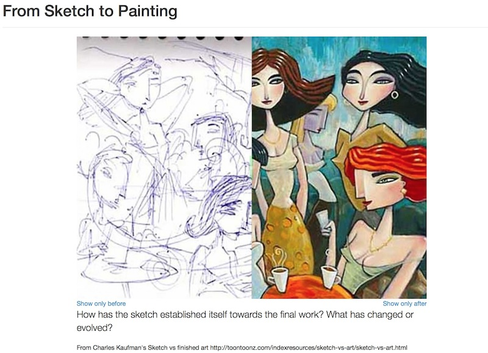
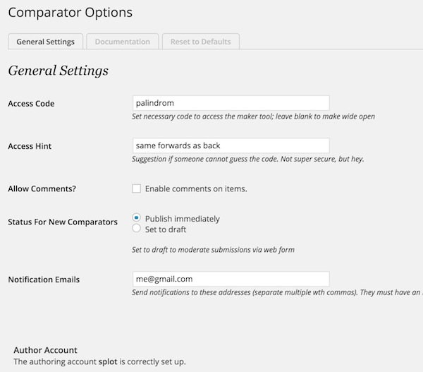
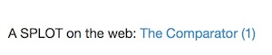

# The Comparator Wordpress Theme
by Alan Levine http://cogdog.info/ or http://cogdogblog.com/

## What is this?
This Wordpress Theme allows you run a version of [The Comparator](http://splot.ca/comparator/) an implementation of a hosted service for creating "before/after" jQuery powered web things.

It allows two images to be compared by using a slider. The above one can be seen at http://splot.ca/comparator/made/36/ which offers links to use directly or embed code. 

The embed code has been tested to work on standalone HTML and in Wordpress (note that in multi-site only NetWork admins can use iframe tags).

## How to Install
I will make the big leap in that you have a self hosted Wordpress site and can install themes. The Comparator is a child theme based on [Wordpress Bootstrap](https://github.com/320press/wordpress-bootstrap) You can grab the most current version from there, I provide the one used to create this first version.

Very very crucial. Do not just use the zip of this repo as a theme upload. It will not work. If you are uploading in the wordpress admin, you will need to make separate zips of the two themes (comparator and wordpress-bootstrap, and upload each.

In addition the site uses the [Remove Dashboard Access plugin[(https://wordpress.org/plugins/remove-dashboard-access-for-non-admins/) which can be installed directly in your site, but a copy is provide just for the sake of completedness.

## Options Screen
Links on the admin bar and under the **Appearance Menu** lead to the available admin options

Enter an access code to force it to be entered as a crude password. The second field provides a hint if they get it wrong. Leaving the access code blank makes it not required.

Activate comments if desired as well as status for new items added. If the default status is "draft" Administrator or Editor approval is required to publish.

The email notification is not yet activated, but will be soon!

## Pages Created
The following Wordpress Pages will be created upon theme activation

* **About** (slug name=about; I use this as a static front page on the site) This actually will embed a working copy below whatever introductory material you created, like http://splot.ca/comparator/about You should create at least one demo version first, and edit line 5 of **page-about.php** to reference this page by title.
* **Embed** (slug name=embed). No content needed, this will provide functionality to embed the things. 
* **Make** (slug name=make) This is the form used to make a Comparator, any content will appear at the top above the form. Example http://splot.ca/comparator/make
* **Random** (slug name=random). No content needed, this will provide functionality generate a link that displays a random Comparator. Exmaple http://splot.ca/comparator/random

## The Secret Author Account
To enable uploading of images via the built in Wordpress media uploader, a visitor to the site is secretly logged in as a user with Authoring role; they never see the Wordpress dashboard ([Remove Dashboard Access plugin[(https://wordpress.org/plugins/remove-dashboard-access-for-non-admins/)  takes care of this).

When a guest user visits the creation form, the code will direct them to the "login desk". If a code is required, it must be entered, and if correct, they are logged in and transferred to the creation form Otherwise they simply click an "activate lasers" link that manages an automatic login and transfers them to the creation form.

Create a user account with Author capability, pick a really cryptic password, as no one will ever enter it. You will have to edit includes/misc.php in your theme folder to hide the password. Yes, this is not iron clad secure and hard core wordpress geeks will ridicule this. But its needed for scripts that run before the options are fetched.

The footer provides a bit of a clue for logged in guest users; anyone logged in as an Editor or higher will show no indication since those roles have normal powers.

Users logged in as the secret account will have a hyperlinked (1) in the footer:

A display of (0) means they are logged in as some other user lacking editing privileges on the site. Clicking the link in either state will log on the current user.

te
